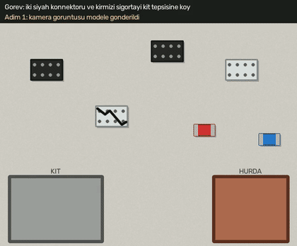

# Çoban — Türk Sanayisi için Shepherd Robotics Klonu

**Çoban**, [Shepherd Robotics (YC Fall 2026)](https://www.ycombinator.com/companies/shepherd-robotics) şirketinin "robot foundation model ile yönetilen genel amaçlı robot" fikrinin Türkiye'ye uyarlanmış bir klonudur. Operatör robota Türkçe bir komut verir ("çatlak konnektörü hurda kutusuna at"). Sistem kameradan görüntü alır ve görme-dil modeli (Gemini) ile **kapalı döngüde** adım adım planlar. Her adımdan sonra sonucu yeni bir görüntüyle doğrular, gerekirse tekrar dener ve her görevi ileride model eğitiminde kullanılmak üzere kaydeder.

Ödev raporu, araştırma ve kaynaklar: **[RAPOR.md](RAPOR.md)**



*Gerçek Gemini ile "iki siyah konnektörü ve kırmızı sigortayı kit tepsisine koy" görevi. Model her adımda ilerlemeyi sayıyor ve beyaz konnektöre dokunmuyor.*

### Gerçek Gemini demoları ([docs/demo/gemini/](docs/demo/gemini/))

| # | Görev | Sonuç | Gösterdiği |
|---|---|---|---|
| 1 | `kırmızı küpleri sarı kutuya koy` | DONE (5 adım) | Çok adımlı planlama, her adımın görüntüyle doğrulanması |
| 2 | `çatlak olan konnektörü hurda kutusuna at` | DONE (3 adım) | Görsel kalite kontrol: çatlak parçayı sağlamlarından ayırma |
| 3 | `mor küpü beyaz tepsiye koy` | IMPOSSIBLE | Masada olmayan nesne için robotu hiç hareket ettirmeme |
| 4 | aynı görev, %40 tutma hatasıyla | DONE (7 adım) | Gripper sensörü kaymayı yakalıyor, model yeniden planlıyor |
| 5 | `iki siyah konnektörü ve kırmızı sigortayı kit tepsisine koy` | DONE (7 adım) | Kablo demeti kitting, ilerleme sayacı |

Her demonun yanında, modelin tüm kararlarını içeren `episode.json` dosyası da var.

## Hızlı başlangıç

```bash
python3 -m venv .venv && source .venv/bin/activate
pip install -r requirements.txt

# 1) API anahtarı olmadan, sadece akışı görmek için (kâhin politika ile)
python main.py --sim --offline-demo
python main.py --sim --scene kablo --offline-demo --fail-rate 0.3

# 2) Gerçek Gemini ile simülasyon (sadece API anahtarı gerekir)
cp .env.example .env               # GEMINI_API_KEY değerini gir
python main.py --sim
python main.py --sim --scene kablo --task "çatlak olan konnektörü hurda kutusuna at"
python main.py --sim --fail-rate 0.3   # tutma hatalarını kapalı döngü nasıl düzeltiyor?
python main.py --sim --fail-rate 0.3 --no-gripper-sensor   # aynısı, sadece görüntüyle doğrulama

# 3) Gerçek kamera ve robot kol
python calibration.py              # bir kez: kamera -> robot kalibrasyonu
python main.py                     # ya da --dry-run (sadece planla, robotu hareket ettirme)

# Testler (donanım ve API anahtarı gerekmez)
python -m unittest discover tests
```

Her görevden sonra `episodes/<tarih>_<görev>/` klasörü oluşur. İçinde `episode.json` (tüm kararlar ve komutlar), `frames/` (modelin gördüğü görüntüler) ve simülasyonda `video.mp4` bulunur. Kâhin politikayla (API'siz) alınmış videolar [docs/demo/offline/](docs/demo/offline/) klasöründe.

## Mimari

```
          ┌──────────────────────── kapalı döngü (task_runner.py) ────────────────────────┐
          ▼                                                                                │
 Kamera / dijital ikiz ──► KVKK yüz bulanıklaştırma ──► Gemini VLA: önceki adım başarılı mı? │
 (vision_capture.py /       (privacy.py, YuNet)          sıradaki adım: AL / BIRAK / BİTTİ   │
  simulator.py)                                          (vla_engine.py)                    │
                                                              │                             │
                                                              ▼                             │
                    güven ve tutarlılık kontrolü ──► kalibrasyon: piksel → mm ──► hareket dizisi
                                                     (calibration.py)          (RobotExecutor)
                                                                                     │
                                                    seri port + DONE onayı ◄─────────┘
                                                    (serial_controller.py → firmware/)
                                                                │
                                         veri çarkı: episode kaydı (episode_logger.py)
```

| Dosya | Görevi |
|---|---|
| `main.py` | Giriş noktası. Simülasyon, donanım ya da sadece planlama modunu kurar |
| `task_runner.py` | Kapalı döngü: gözlem → karar → doğrulama → hareket. Tekrar deneme ve güvenlik kontrolleri burada. `RobotExecutor` AL/BIRAK hareket dizilerini yürütür |
| `vla_engine.py` | Gemini'ye görüntü, Türkçe görev, geçmiş adımlar ve gripper durumunu gönderir. JSON şemasıyla sıradaki adımı alır |
| `simulator.py` | Dijital ikiz: sanal kamera, sanal robot kol ve fizik. `renkler` ve `kablo` (kablo demeti kitting) sahneleri. API'siz demo için `OraclePolicy` |
| `privacy.py` | KVKK: görüntüdeki yüzleri buluta gönderilmeden ve kaydedilmeden önce pikselleştirir |
| `episode_logger.py` | Veri çarkı: her görevi veri seti olarak kaydeder (JSON, kareler, video) |
| `calibration.py` | Kamera pikseli → robot mm dönüşümü (homografi) ve interaktif kalibrasyon aracı |
| `serial_controller.py` | Mikrodenetleyiciyle JSON protokolü. Her komut için `DONE` bekler |
| `vision_capture.py` | OpenCV kamera, gerçek çözünürlük, JPEG, hata ayıklama görüntüsü |
| `config.py` | Tüm ayarlar `.env` dosyasından okunur |
| `firmware/` | Arduino/STM32: JSON komut ayrıştırma, çalışma alanı sınırları, gripper servosu, isteğe bağlı çene sensörü |
| `tests/` | 41 birim ve uçtan uca test (simülasyon üzerinde kapalı döngü dahil) |

### Kapalı döngü nasıl çalışıyor?

Her adımda model görüntüyle birlikte şunları alır: Türkçe görev, şimdiye kadar yapılan adımlar ve gripper'ın tuttuğu sanılan nesne. Model şu soruları cevaplar:

1. **Önceki adım gerçekten başarılı oldu mu?** Örneğin AL'dan sonra nesne gerçekten gripper'ın arasında mı? Başarısızsa sistem durumu düzeltir ve yeniden planlar. `MAX_RETRIES` kez üst üste başarısız olursa operatörü çağırır.
2. **Görev bitti mi (DONE), imkânsız mı (IMPOSSIBLE), yoksa sıradaki adım ne?** Sıradaki adım AL ya da BIRAK, nokta 0–1000 arası normalize koordinatla verilir.

**Görme + dokunma sensör füzyonu:** Görüntüden bir tutmanın başarısız olduğunu anlamak her zaman kolay değildir. Gerçek testte nesne sadece 1-2 cm kaydığında Gemini bunu fark edemedi. Bu yüzden gripper'ın çene sensörü, CLOSE komutundan sonra `DONE HELD` ya da `DONE EMPTY` bildirir. Sensör "boş" derse adım modele sorulmadan başarısız sayılır; "dolu" derse bu bilgi de modele iletilir. Sensörsüz kartlarda sistem sadece görüntüyle doğrulamaya devam eder.

**API dayanıklılığı:** Gemini geçici olarak yanıt veremezse (429/500/503/504) istek artan bekleme süreleriyle (3, 8, 15, 30 sn) tekrarlanır. Ana model yine yanıt vermezse `GEMINI_FALLBACK_MODEL`'e geçilir.

Ek güvenlik kontrolleri:
- `MIN_CONFIDENCE` altındaki kararlarda robot hareket etmez.
- Mantıksız kararlar reddedilir (örneğin gripper doluyken AL).
- Firmware çalışma alanı dışındaki hedefleri reddeder.
- Kalibrasyon yoksa gerçek robot hiç hareket ettirilmez.

## Ayarlar (`.env`)

| Değişken | Varsayılan | Açıklama |
|---|---|---|
| `GEMINI_API_KEY` | — | Zorunlu (`--offline-demo` hariç). https://aistudio.google.com/apikey |
| `GEMINI_MODEL` | `gemini-3.8-flash` | Kullanılacak Gemini modeli |
| `GEMINI_FALLBACK_MODEL` | `gemini-3.5-flash-lite` | Ana model aşırı yoğunken kullanılan yedek model |
| `CAMERA_INDEX` / `CAMERA_WIDTH` / `CAMERA_HEIGHT` | `0` / `640` / `480` | Kamera (çözünürlük sadece istektir; gerçek boyut her karede okunur) |
| `SERIAL_PORT` / `SERIAL_BAUDRATE` | otomatik / `115200` | Örn. `/dev/cu.usbmodem1101`, `COM3` |
| `ACK_TIMEOUT_SEC` | `10` | Bir komutun `DONE` cevabı için en fazla bekleme süresi |
| `MIN_CONFIDENCE` | `0.6` | Bu güvenin altında robot hareket etmez |
| `CALIBRATION_FILE` | `calibration.json` | |
| `SAFE_Z_MM` / `GRASP_Z_MM` | `80` / `10` | Yaklaşma ve tutma yüksekliği |
| `PARK_X_MM` / `PARK_Y_MM` | `0` / `30` | BIRAK'tan sonra kolun bekleyeceği, kameranın görmediği nokta |
| `MAX_STEPS` / `MAX_RETRIES` | `12` / `3` | Görev başına en fazla model çağrısı / üst üste başarısız adım |
| `BLUR_FACES` | `true` | KVKK yüz bulanıklaştırma |
| `EPISODES_DIR` / `DEBUG_DIR` | `episodes` / `debug` | Kayıt klasörleri |

## Gerçek donanım

1. **Firmware:** Arduino IDE → Library Manager → **ArduinoJson** (v7) kur. `firmware/shepherd_firmware/shepherd_firmware.ino` dosyasındaki `moveTo()` fonksiyonunu kendi kolunun ters kinematiğiyle doldur, pin ve sınırları düzenle, karta yükle. Gripper'da konum geri bildirimli bir servo varsa `GRIPPER_FEEDBACK_PIN` ve `GRIPPER_EMPTY_READING` değerlerini ayarla; sensör desteği o zaman devreye girer.
2. **Kalibrasyon:** Masaya robot koordinatlarını bildiğin en az 4 (tercihen 6+) işaret koy, `python calibration.py` çalıştır, her işarete tıkla ve X Y değerini gir, `c` tuşuna bas. Kamerayı sonradan oynatma.
3. `python main.py --dry-run` ile önce sadece planlamayı dene, sonra `python main.py` ile gerçek çalıştırmaya geç.

## Lisanslar

YuNet yüz algılama modeli (`models/face_detection_yunet_2023mar.onnx`) [OpenCV Zoo](https://github.com/opencv/opencv_zoo/tree/main/models/face_detection_yunet) kaynaklıdır ve MIT lisanslıdır.
